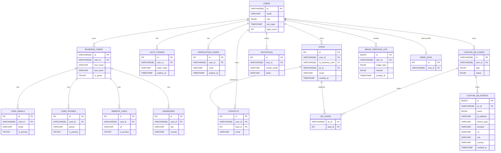

# Database Schema

## Users Table (core)
```sql
CREATE TABLE users (
    id VARCHAR(36) PRIMARY KEY,                -- UUID
    email VARCHAR(255) UNIQUE NOT NULL,
    password_hash VARCHAR(255) NULL DEFAULT NULL,
    is_active TINYINT(1) NOT NULL DEFAULT 1,
    role ENUM('user','admin','demo') NOT NULL DEFAULT 'user',
    last_login TIMESTAMP NULL,
    login_count INT NOT NULL DEFAULT 0,
    created_at TIMESTAMP DEFAULT CURRENT_TIMESTAMP,
    updated_at TIMESTAMP DEFAULT CURRENT_TIMESTAMP ON UPDATE CURRENT_TIMESTAMP
);
```
Notes:
- Dual auth supported (password or email code). `password_hash` may be NULL.
- Demo users are flagged with `role='demo'`.

## Business Cards Tables
```sql
CREATE TABLE business_cards (
    id VARCHAR(36) PRIMARY KEY,                -- UUID
    user_id VARCHAR(36) NOT NULL,              -- users.id
    first_name VARCHAR(100) NOT NULL,
    last_name VARCHAR(100) NOT NULL,
    primary_phone VARCHAR(40) NULL,
    company_name VARCHAR(200) NULL,
    job_title VARCHAR(200) NULL,
    bio TEXT NULL,
    profile_photo VARCHAR(255) NULL,
    company_logo VARCHAR(255) NULL,
    cover_graphic VARCHAR(255) NULL,
    theme_key VARCHAR(64) NULL,
    is_active TINYINT(1) NOT NULL DEFAULT 1,
    created_at TIMESTAMP DEFAULT CURRENT_TIMESTAMP,
    updated_at TIMESTAMP DEFAULT CURRENT_TIMESTAMP ON UPDATE CURRENT_TIMESTAMP,
    KEY idx_user (user_id),
    KEY idx_active (is_active)
);
```

### Emails / Phones (additional contact info)
```sql
CREATE TABLE card_emails (
    id INT PRIMARY KEY AUTO_INCREMENT,
    card_id VARCHAR(36) NOT NULL,
    label VARCHAR(32) NOT NULL,             -- personal, work, other
    email VARCHAR(255) NOT NULL,
    is_primary TINYINT(1) NOT NULL DEFAULT 0,
    created_at TIMESTAMP DEFAULT CURRENT_TIMESTAMP,
    KEY idx_card (card_id),
    CONSTRAINT fk_email_card FOREIGN KEY (card_id) REFERENCES business_cards(id) ON DELETE CASCADE
);

CREATE TABLE card_phones (
    id INT PRIMARY KEY AUTO_INCREMENT,
    card_id VARCHAR(36) NOT NULL,
    label VARCHAR(32) NOT NULL,             -- mobile, work, home, other
    phone VARCHAR(64) NOT NULL,
    is_primary TINYINT(1) NOT NULL DEFAULT 0,
    created_at TIMESTAMP DEFAULT CURRENT_TIMESTAMP,
    KEY idx_card (card_id),
    CONSTRAINT fk_phone_card FOREIGN KEY (card_id) REFERENCES business_cards(id) ON DELETE CASCADE
);
```

### Website Links
```sql
CREATE TABLE website_links (
    id INT PRIMARY KEY AUTO_INCREMENT,
    card_id VARCHAR(36) NOT NULL,
    name VARCHAR(100) NOT NULL,
    url VARCHAR(500) NOT NULL,
    is_primary TINYINT(1) NOT NULL DEFAULT 0,
    created_at TIMESTAMP DEFAULT CURRENT_TIMESTAMP,
    KEY idx_card_id (card_id),
    CONSTRAINT fk_website_card FOREIGN KEY (card_id) REFERENCES business_cards(id) ON DELETE CASCADE
);
```

### Addresses
```sql
CREATE TABLE addresses (
    id INT PRIMARY KEY AUTO_INCREMENT,
    card_id VARCHAR(36) NOT NULL,
    street VARCHAR(255),
    city VARCHAR(100),
    state VARCHAR(100),
    zip VARCHAR(20),
    country VARCHAR(100),
    created_at TIMESTAMP DEFAULT CURRENT_TIMESTAMP,
    KEY idx_card_id (card_id),
    CONSTRAINT fk_address_card FOREIGN KEY (card_id) REFERENCES business_cards(id) ON DELETE CASCADE
);
```

## Authentication Tables
```sql
CREATE TABLE auth_tokens (
    id INT PRIMARY KEY AUTO_INCREMENT,
    user_id VARCHAR(36) NOT NULL,
    token_hash VARCHAR(255) NOT NULL,
    expires_at TIMESTAMP NOT NULL,
    created_at TIMESTAMP DEFAULT CURRENT_TIMESTAMP,
    KEY idx_user_id (user_id),
    INDEX idx_token_hash (token_hash),
    INDEX idx_expires (expires_at)
);
```

```sql
-- Optional email verification codes (passwordless)
CREATE TABLE verification_codes (
    id INT PRIMARY KEY AUTO_INCREMENT,
    user_id VARCHAR(36) NOT NULL,
    code VARCHAR(12) NOT NULL,
    expires_at TIMESTAMP NOT NULL,
    created_at TIMESTAMP DEFAULT CURRENT_TIMESTAMP,
    KEY idx_user (user_id),
    KEY idx_code (code)
);
```

---

## Custom QR Codes (NEW)

### custom_qr_codes
```sql
CREATE TABLE custom_qr_codes (
    id VARCHAR(36) NOT NULL PRIMARY KEY,            -- UUID
    user_id VARCHAR(36) NOT NULL,                   -- users.id (UUID)
    type ENUM('default','url','social','text','wifi','appstore') NOT NULL DEFAULT 'default',
    payload_json JSON NULL,                         -- type-specific payload
    title VARCHAR(120) NULL,
    slug VARCHAR(160) NULL UNIQUE,
    theme_key VARCHAR(64) NULL,
    cover_image_url VARCHAR(512) NULL,
    landing_title VARCHAR(160) NULL,
    landing_html MEDIUMTEXT NULL,
    show_lead_form TINYINT(1) NOT NULL DEFAULT 1,
    status ENUM('active','inactive') NOT NULL DEFAULT 'active',
    created_at TIMESTAMP DEFAULT CURRENT_TIMESTAMP,
    updated_at TIMESTAMP DEFAULT CURRENT_TIMESTAMP ON UPDATE CURRENT_TIMESTAMP,
    KEY idx_user (user_id),
    KEY idx_status (status),
    KEY idx_type (type),
    KEY idx_created_at (created_at)
);
```

### custom_qr_events
```sql
CREATE TABLE custom_qr_events (
    id BIGINT PRIMARY KEY AUTO_INCREMENT,
    qr_id VARCHAR(36) NOT NULL,                         -- custom_qr_codes.id
    event ENUM('view','redirect','lead_submit') NOT NULL,
    event_target VARCHAR(255) NULL,
    session_id VARCHAR(64) NULL,
    ip_address VARCHAR(45) NULL,
    user_agent TEXT NULL,
    referrer TEXT NULL,
    -- analytics enrichment
    device_type VARCHAR(50) NULL,                       -- Mobile / Tablet / Desktop / Unknown
    browser VARCHAR(100) NULL,                          -- Chrome / Safari / Firefox / Edge / Opera / Other
    os VARCHAR(100) NULL,                               -- iOS / Android / Windows / macOS / Linux / Other
    city VARCHAR(120) NULL,
    country VARCHAR(120) NULL,
    created_at TIMESTAMP DEFAULT CURRENT_TIMESTAMP,
    KEY idx_qr_created (qr_id, created_at),
    KEY idx_event (event)
);
```

### qr_leads (linking to existing `leads`)
```sql
CREATE TABLE qr_leads (
    qr_id VARCHAR(36) NOT NULL,   -- custom_qr_codes.id
    lead_id INT NOT NULL,         -- leads.id
    created_at TIMESTAMP DEFAULT CURRENT_TIMESTAMP,
    KEY idx_qr (qr_id),
    KEY idx_lead (lead_id)
);
```

### leads table adjustment
```sql
-- Existing leads table updated to support QR sources
ALTER TABLE leads
  MODIFY COLUMN id_business_card VARCHAR(36) NULL,  -- now nullable
  ADD COLUMN qr_id VARCHAR(36) NULL AFTER id_business_card;
```

---

## Routing & Public Handling (Reference)
- Public scans are served by `web/public/qr.php` → `/qr/{uuid}`
- Inactive QR codes return a friendly branded page (`public/includes/qr/inactive.php`)
- Rate limiting is applied via a file-based limiter with IP whitelist

---

## Leads & Contacts

### leads
```sql
CREATE TABLE leads (
    id INT PRIMARY KEY AUTO_INCREMENT,
    user_id VARCHAR(36) NOT NULL,              -- owner
    id_business_card VARCHAR(36) NULL,         -- nullable after QR linkage
    qr_id VARCHAR(36) NULL,                    -- custom_qr_codes.id
    first_name VARCHAR(100) NULL,
    last_name VARCHAR(100) NULL,
    email VARCHAR(255) NULL,
    phone VARCHAR(64) NULL,
    company VARCHAR(200) NULL,
    title VARCHAR(200) NULL,
    address TEXT NULL,
    notes TEXT NULL,
    source_url VARCHAR(512) NULL,
    ip_address VARCHAR(45) NULL,
    user_agent TEXT NULL,
    created_at TIMESTAMP DEFAULT CURRENT_TIMESTAMP,
    KEY idx_user (user_id),
    KEY idx_card (id_business_card),
    KEY idx_qr (qr_id)
);
```

### contacts
```sql
CREATE TABLE contacts (
    id INT PRIMARY KEY AUTO_INCREMENT,
    user_id VARCHAR(36) NOT NULL,
    lead_id INT NULL,                          -- if converted from a lead
    first_name VARCHAR(100) NOT NULL,
    last_name VARCHAR(100) NOT NULL,
    email VARCHAR(255) NULL,
    phone VARCHAR(64) NULL,
    company VARCHAR(200) NULL,
    title VARCHAR(200) NULL,
    address TEXT NULL,
    notes TEXT NULL,
    created_at TIMESTAMP DEFAULT CURRENT_TIMESTAMP,
    updated_at TIMESTAMP DEFAULT CURRENT_TIMESTAMP ON UPDATE CURRENT_TIMESTAMP,
    KEY idx_user (user_id),
    KEY idx_lead (lead_id)
);
```

---

## Invitations (User Growth)
```sql
CREATE TABLE invitations (
    id INT PRIMARY KEY AUTO_INCREMENT,
    user_id VARCHAR(36) NOT NULL,           -- sender
    invitee_name VARCHAR(200) NULL,
    invitee_email VARCHAR(255) NOT NULL,
    card_id VARCHAR(36) NULL,               -- optional business card to showcase
    token VARCHAR(64) NOT NULL,
    status ENUM('sent','opened','responded','converted','bounced') NOT NULL DEFAULT 'sent',
    response ENUM('interested','not_interested','no_response') NULL,
    opened_at TIMESTAMP NULL,
    responded_at TIMESTAMP NULL,
    created_at TIMESTAMP DEFAULT CURRENT_TIMESTAMP,
    KEY idx_user (user_id),
    KEY idx_email (invitee_email),
    KEY idx_token (token)
);
```

---

## Image Creation Logging (Audit)
```sql
CREATE TABLE image_creation_log (
    id BIGINT PRIMARY KEY AUTO_INCREMENT,
    user_id VARCHAR(36) NULL,
    image_type ENUM('profile','logo','cover','virtual_background','name_tag','other') NOT NULL,
    method ENUM('upload','generate','demo_copy') NOT NULL,
    file_path VARCHAR(512) NULL,
    file_size_bytes INT NULL,
    width INT NULL,
    height INT NULL,
    page_url VARCHAR(512) NULL,
    page_params TEXT NULL,
    ip_address VARCHAR(45) NULL,
    user_agent TEXT NULL,
    created_at TIMESTAMP DEFAULT CURRENT_TIMESTAMP,
    KEY idx_user (user_id),
    KEY idx_type (image_type),
    KEY idx_method (method)
);
```

---

## Demo Data (for TestFlight reviewers)
```sql
CREATE TABLE demo_data (
    id INT PRIMARY KEY AUTO_INCREMENT,
    user_id VARCHAR(36) UNIQUE NOT NULL, -- demo user
    data JSON NOT NULL,                  -- minimized seed data
    created_at TIMESTAMP DEFAULT CURRENT_TIMESTAMP
);
```

---

## Entity Relationship Diagram (ERD)




## Future Tables (Backlog Features)

### Connections Table
```sql
CREATE TABLE connections (
    id INT PRIMARY KEY AUTO_INCREMENT,
    user_id INT NOT NULL,
    connected_card_id INT NOT NULL,
    connected_at TIMESTAMP DEFAULT CURRENT_TIMESTAMP,
    notes TEXT,
    
    FOREIGN KEY (user_id) REFERENCES users(id) ON DELETE CASCADE,
    FOREIGN KEY (connected_card_id) REFERENCES business_cards(id) ON DELETE CASCADE,
    UNIQUE KEY unique_connection (user_id, connected_card_id),
    INDEX idx_user_connections (user_id)
);
```

### Chat Messages Table
```sql
CREATE TABLE chat_messages (
    id INT PRIMARY KEY AUTO_INCREMENT,
    connection_id INT NOT NULL,
    sender_user_id INT NOT NULL,
    message TEXT NOT NULL,
    sent_at TIMESTAMP DEFAULT CURRENT_TIMESTAMP,
    read_at TIMESTAMP NULL,
    
    FOREIGN KEY (connection_id) REFERENCES connections(id) ON DELETE CASCADE,
    FOREIGN KEY (sender_user_id) REFERENCES users(id) ON DELETE CASCADE,
    INDEX idx_connection_messages (connection_id, sent_at)
);
```